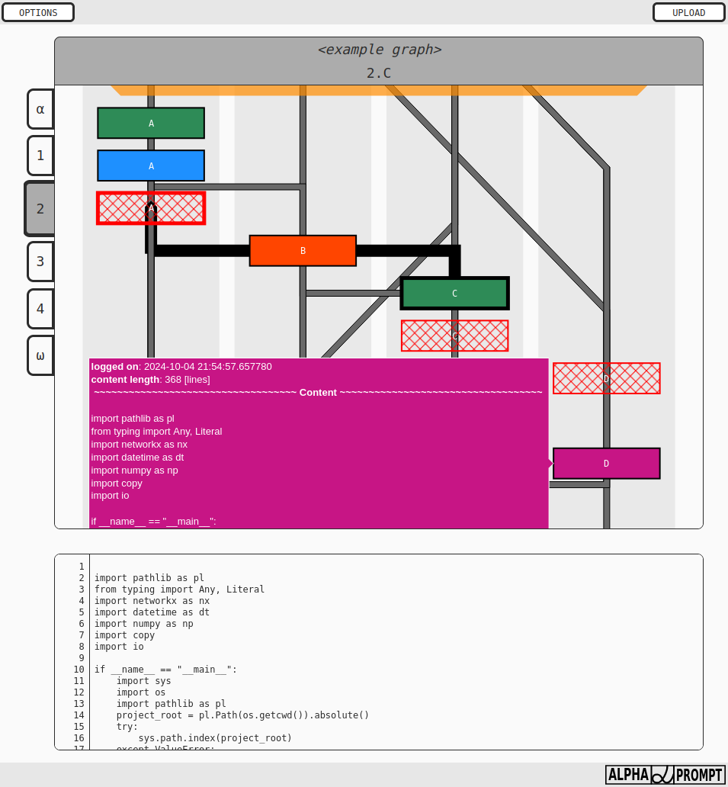
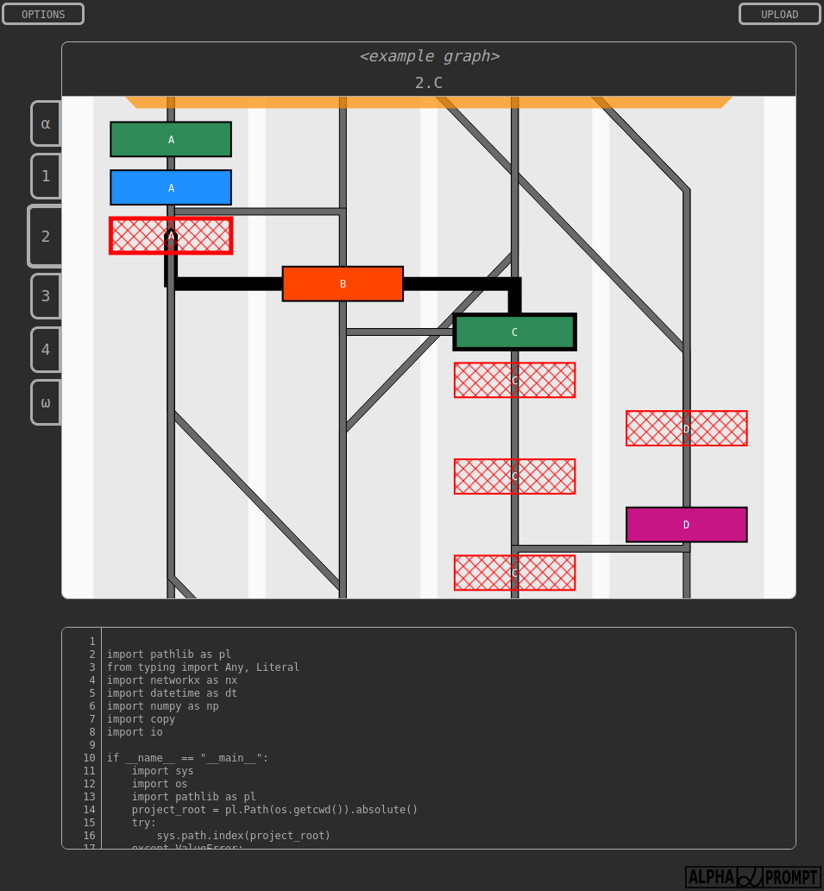

# LLM-logger

LLM logger is a logger & visualisation tool for LLM though process such as Chain-of-though, Tree-of-thought, etc.

LLM logger tracks the messages among LLM agents and preserves them within a graph-like structure. This assures that not only content of the messages is preserved, but also the sender-receiver with accompanying info about the sender-receiver relation.

The messages are naturally logged at particular time, creating a *conversation flow* with beginning and an end. This enables to visually represent the graph vertically (beginning at the top, end at the bottom). The messages are displayed in columns, where a column represents one (or more) LLM agents. 

The vertical format with partitioned messages into columns allows for efficient visual checks. The user is not overwhelmed by large amount of text (like in regular .log files) and can visually check whether communication occured (link crossing in between LLM agents) or not (no link) in a blink of an eye. If further investigation is required, the right side of the application is reserved for displating the full context of the message with responsive line numbers (e.g. similar to VS Code) to keep easy track of the information occuring at the same visual-spatial place, further easing the analysis.

# Content

LLM logger composes of 2 parts:

1) llm_logger_src - source code of the logger tracking multi agent commincation & storing it in a graph-like structure
2) llm_logger_app - user-interface for interactive display of the graph-like logged structures

# User interface

The user interface is divided into 2 parts, left-side and right-side:
1) left-side - displays graph-like log as a partitioned graph
    - offers navigation elements (bookmarks of chapters)
    - is interactive (both both nodes and vertices have on-hover partial display of the content)
    - keeps track of current user interaction (on-click highlights the clicked node/vertex and any directly neighboring verices)
2) right-side - right side is reserved for full display of messages
    - text has responsive line-numbers (long lines are wrapped with line-numbers following the void caused by line wrapping)

")

Visualisation tool is fully responsive (adjusts to vertical format on narrow screens).

And includes light/dark mode for comfortable reading.

# How to use this repo

`llm_logger_app` (visualisation tool) can run out-of-the-box with `/__data/test_graph_log.gml` loaded automatically.

1) clone/download the repository
2) install `requirements.txt`
3) run `/llm_logger_app/index.py` as a regular python script
4) visualize other logged data -> press *UPLOAD* button and upload `<file>.gml` logged by `LLMLogger`. 

`llm_logger_src` includes `/llm_logger_src/llm_logger.py` with `LLMLogger`.

1) clone/download the repository
2) check the function `LLMLogger._test` which generates `test_graph_log.gml` using all supported visualisations
