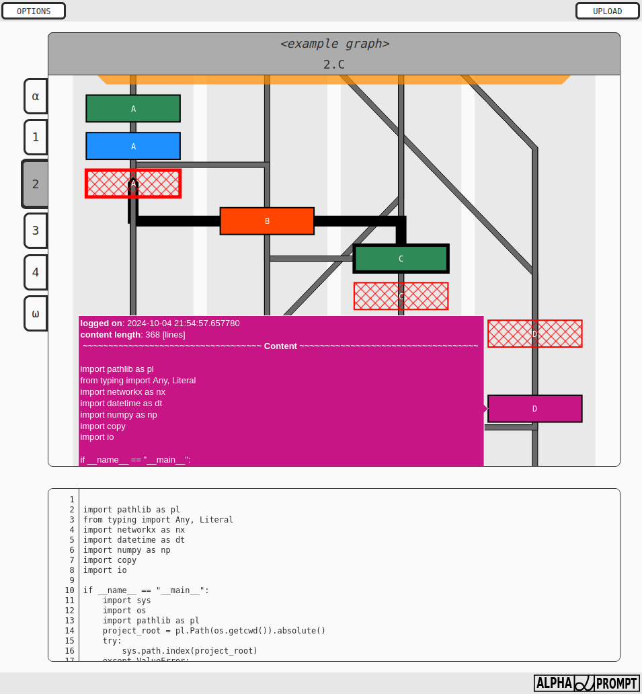
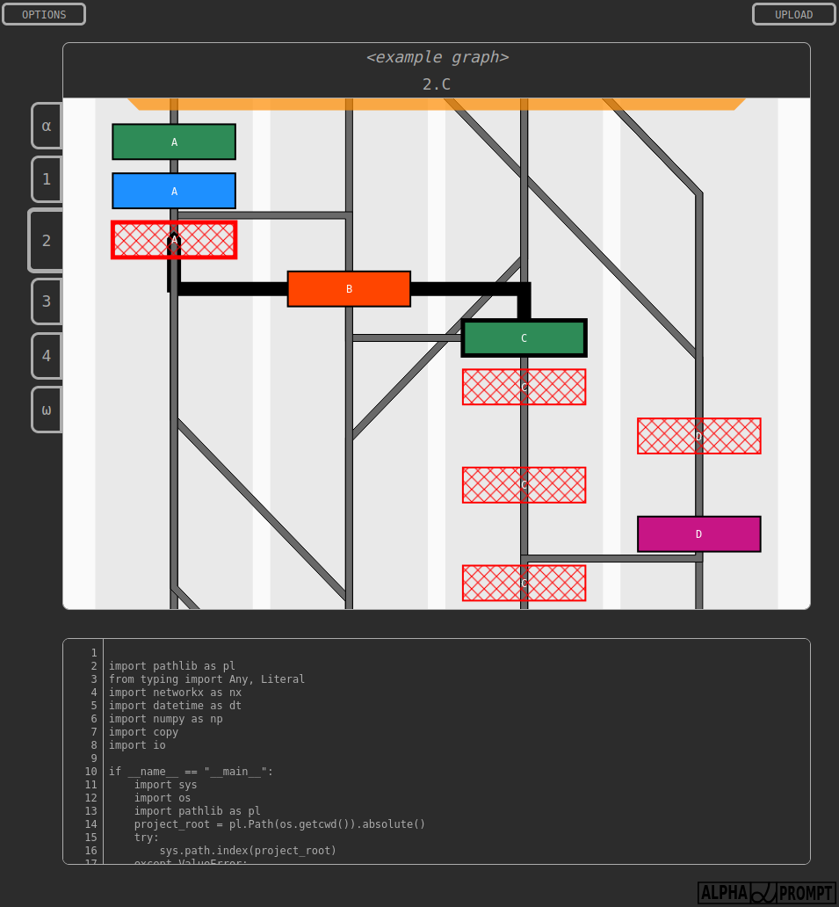

# LLM-logger

LLM logger is a logger & visualisation tool for LLM-based systems and processes such as Chain-of-though, Tree-of-thought, Multi-Agent Systems, Retrieval Augmented Generation (RAG), etc.

# Problem that this tool solves

LLM systems (especially agentic systems) can create hard-to-track conversations with hundreds or throusands of entries. If the messages are logged into a text file, it might not be possible to detect deviations in the conversation flow. **LLM-logger** helps to visualize the conversation flow (e.g. among agents, or within a RAG system) as a scrollable-graph that naturally displays the conversation in chronological order.

**LLM-logger** is split into 2 tools/sub-packages:

1) **logger** tracks messages passed within the system with one or more LLMs and preserves them within a graph-like structure. This graph-structure keeps the sender-receiver information and the content of the passed message in chronological order.

2) **visualizer** interprets the graph and interactively displays the logged data in a browser.

The vertical format with partitioned messages into columns allows for efficient visual checks. The user is not overwhelmed by large amount of text (like in regular .log files) and can visually check whether communication occured (link crossing in between LLM agents) or not (no link) in a blink of an eye. If further investigation is required, the right side of the application is reserved for displating the full context of the message with responsive line numbers (e.g. similar to VS Code) to keep easy track of the information occuring at the same visual-spatial place, further easing the analysis.

# Content

LLM logger is composed of 2 parts:

1) llm_logger_src - source code of the logger tracking multi agent commincation & storing it in a graph-like structure
2) llm_logger_app - user-interface for interactive display of the graph-like logged structures

# User interface

The user interface is divided into 2 parts, left-side and right-side:
1) left-side - displays graph-like log as a partitioned graph
    - offers navigation elements (bookmarks of chapters)
    - is interactive (both both nodes and vertices have on-hover partial display of the content)
    - keeps track of current user interaction (on-click highlights the clicked node/vertex and any directly neighboring verices)
2) right-side - right side is reserved for full display of messages
    - text has responsive line-numbers (long lines are wrapped with line-numbers following the void caused by line wrapping)

")

Visualisation tool is fully responsive (adjusts to vertical format on narrow screens).

And includes light/dark mode for comfortable reading.

# How to use this repo

`llm_logger_app` (visualisation tool) can run out-of-the-box with `/__data/test_graph_log.gml` loaded automatically.

1) clone/download the repository
2) install `requirements.txt`
3) run `/llm_logger_app/index.py` as a regular python script
4) visualize other logged data -> press *UPLOAD* button and upload `<file>.gml` logged by `LLMLogger`. 

`llm_logger_src` includes `/llm_logger_src/llm_logger.py` with `LLMLogger`.

1) clone/download the repository
2) check the function `LLMLogger._test` which generates `test_graph_log.gml` using all supported visualisations
