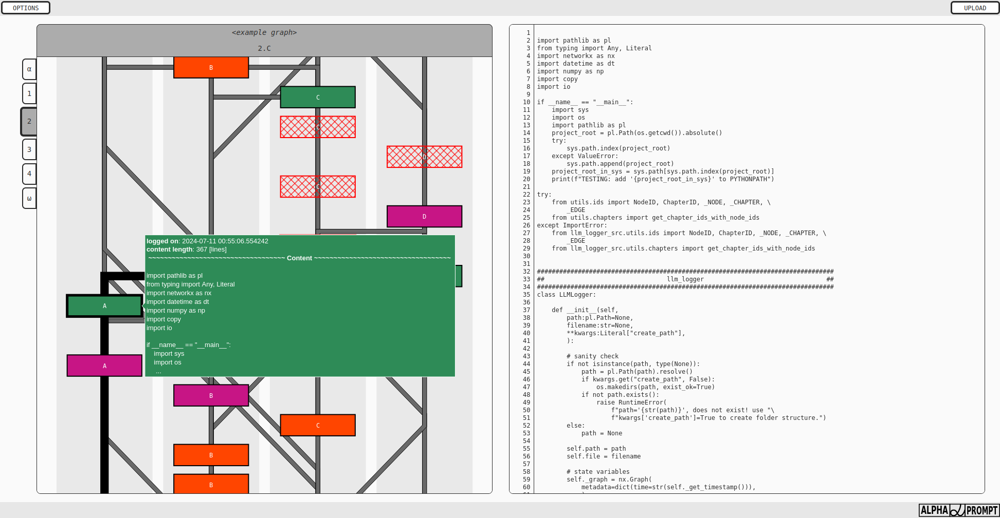

# LLM-logger

(under *development*)

*Logger* & *visualization* tool for multi-agent systems, succinctly displaying 
all messages (nodes) sent among multiple agents in chronological manner.

Enables to debug complex and iterative prompt-strategies by swiftly parsing the 
agent communication without overwhelming the user by unmanageable amount of 
text logged through through regular loggers.

The application is using Dash framework with Plotly for low-overhead to enable 
scrolling through hundreds of messages seamlessly. 

Server-side is written in Python with minor functions delegated to client-side
to allow for responsive design without overloading the server side.

## UI illustration

Running the ```<root>/llm_logger_app/index.py``` runs the Visualization tool in local browser.




## Development related 

Due to novelty of the UI which is an amalgamation of interactive graph and 
word-processing software (read-only at the moment), the Dash layout and naming 
is motivated by general layout of a web-site.

### Naming convention for CSS/HTML


(downloaded from https://webstyleguide.com/wsg3/6-page-structure/3-site-design.html)

